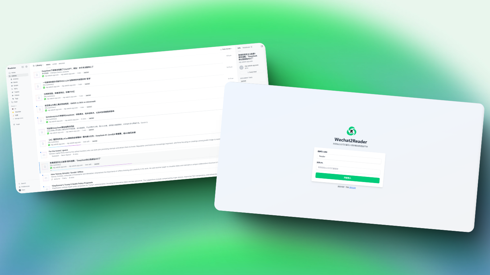

<p align="center">
  
</p>

# Wechat2Reader

[中文](README.md) | English

Import WeChat articles to Reader or Readwise.

<p align="center">
  
</p>

## Features
- 📱 Support for WeChat Official Account articles
- 🔄 Import to Reader or Readwise

## Requirements

- Python 3.8+
- Google Chrome browser
- Windows/macOS/Linux

## Installation

1. Clone the repository:
```bash
git clone https://github.com/Penn-Lam/Wechat2Reader.git
cd Wechat2Reader
```

2. Install dependencies:
```bash
pip install -r requirements.txt
```

3. Install ChromeDriver:
   - Windows:
     1. Create chromedriver folder:
     ```powershell
     mkdir chromedriver
     ```
     2. Get Chrome version:
     ```powershell
     (Get-Item (Get-ItemProperty 'HKLM:\SOFTWARE\Microsoft\Windows\CurrentVersion\App Paths\chrome.exe').'(Default)').VersionInfo.FileVersion
     ```
     3. Download matching ChromeDriver (replace VERSION with the version from step 2):
     ```powershell
     curl -L "https://edgedl.me.gvt1.com/edgedl/chrome/chrome-for-testing/VERSION/win64/chromedriver-win64.zip" -o chromedriver\chromedriver.zip
     ```
     4. Extract and move files:
     ```powershell
     Expand-Archive -Path "chromedriver\chromedriver.zip" -DestinationPath "chromedriver" -Force
     Move-Item -Path "chromedriver\chromedriver-win64\chromedriver.exe" -Destination "chromedriver\chromedriver.exe" -Force
     ```

   - macOS:
     1. Create chromedriver folder:
     ```bash
     mkdir chromedriver
     ```
     2. Get Chrome version:
     ```bash
     /Applications/Google\ Chrome.app/Contents/MacOS/Google\ Chrome --version | awk '{print $3}'
     ```
     3. Download matching ChromeDriver(replace VERSION with the version from step 2):
     ```bash
     curl -L "https://edgedl.me.gvt1.com/edgedl/chrome/chrome-for-testing/VERSION/mac-x64/chromedriver-mac-x64.zip" -o chromedriver/chromedriver.zip
     ```
     4. Extract and move files:
     ```bash
     unzip chromedriver/chromedriver.zip -d chromedriver/
     mv chromedriver/chromedriver-mac-x64/chromedriver chromedriver/
     chmod +x chromedriver/chromedriver
     ```

   - Linux:
     1. Create chromedriver folder:
     ```bash
     mkdir chromedriver
     ```
     2. Get Chrome version:
     ```bash
     google-chrome --version | awk '{print $3}'
     ```
     3. Download matching ChromeDriver(replace VERSION with the version from step 2):
     ```bash
     curl -L "https://edgedl.me.gvt1.com/edgedl/chrome/chrome-for-testing/VERSION/linux64/chromedriver-linux64.zip" -o chromedriver/chromedriver.zip
     ```
     4. Extract and move files:
     ```bash
     unzip chromedriver/chromedriver.zip -d chromedriver/
     mv chromedriver/chromedriver-linux64/chromedriver chromedriver/
     chmod +x chromedriver/chromedriver
     ```

4. Configure API key:
   - Copy `config.template.ini` to `config.ini`
   - Get your API key from https://readwise.io/access_token
   - Fill in your API key in `config.ini`

## Usage

1. Start the server:
```bash
python app.py
```

2. In the web interface:
   - Select target platform
      - Reader（It's usually Reader）
      - Readwise
   - Paste the WeChat article URL
   - Click "Start Import"
   
3. After the import is complete, delete the example article used for testing.

## Troubleshooting

1. **Chrome browser not installed**
   - Please install the latest version of Google Chrome

2. **ChromeDriver issues**
   - If you encounter ChromeDriver errors, try:
     1. Ensure Chrome browser is up to date
     2. If in mainland China, you might need a VPN
     3. If all else fails, try manual installation

3. **API key errors**
   - Ensure `config.ini` is properly configured
   - Verify API key is valid

4. **Article import fails**
   - Ensure the URL is from a WeChat Official Account
   - Verify the article is accessible (Non-paid articles)

## Contributing

Pull Requests and Issues are welcome!

## License

This project is licensed under the MIT License - see the [LICENSE](LICENSE.txt) file for details
